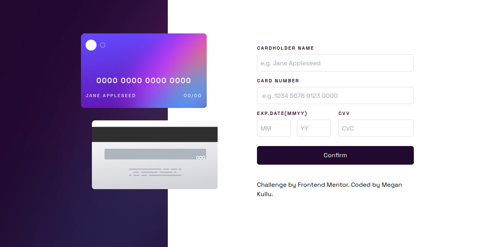

# Frontend Mentor - Interactive card details form solution

This is a solution to the [Interactive card details form challenge on Frontend Mentor](https://www.frontendmentor.io/challenges/interactive-card-details-form-XpS8cKZDWw). Frontend Mentor challenges are designed to help one improve their coding skills by building realistic projects. 

## Table of contents

- [Overview](#overview)
  - [The challenge](#the-challenge)
  - [Screenshot](#screenshot)
  - [Links](#links)
- [My process](#my-process)
  - [Built with](#built-with)
  - [What I learned](#what-i-learned)
  - [Continued development](#continued-development)
  - [Useful resources](#useful-resources)
- [Author](#author)


## Overview

### The challenge

The challenge was to:

- Fill in the form and see the card details update in real-time
- Receive error messages when the form is submitted if:
  - Any input field is empty
  - The card number, expiry date, or CVC fields are in the wrong format
- View the optimal layout depending on their device's screen size
- See hover, active, and focus states for interactive elements on the page

### Screenshot




### Links

- Solution URL: [Solution URL](https://interactive-card-details-main.netlify.app/)
- Live Site URL: [Live site url](https://interactive-card-details-main.netlify.app/)

## My process

### Built with

- Semantic HTML5 markup
- CSS custom properties
- Flexbox
- Mobile-first workflow
- [Tailwind](https://tailwindcss.com/) - CSS library


### What I learned

I learnt how to achieve real time validation using event listeners in Javascript, I also learnt about regex expressions and how to use them to match and test variables and apply them in conditionals. I also learnt how to apply negative margins and z-index to achieve the intended layout.

Some javascript I am proud of:

```javascript
if (/\d/.test(trimmedCardholderName)) {
        cardholderNameError.innerHTML = "Cardholder name cannot contain numbers";
        return false;
    }
```

### Continued development
 
I want to focus on building projects using React Framework and Next.js library.


### Useful resources

- [Mozilla.org](https://developer.mozilla.org/en-US/docs/Web/JavaScript/Guide/Regular_expressions) - This helped me understand regular expressions and methods to apply to them.
- [JavaScript Tutorial](https://www.javascripttutorial.net/javascript-dom/javascript-form-validation/) - This is an amazing article which helped me with a step by step example on how to implement form validation.


## Author

- LinkedIn - [Megan Kullu](https://www.your-site.com)
- Frontend Mentor - [@yourusername](https://www.frontendmentor.io/profile/MeganKullu)
- Twitter - [@megankullu](https://www.twitter.com/megankullu)


